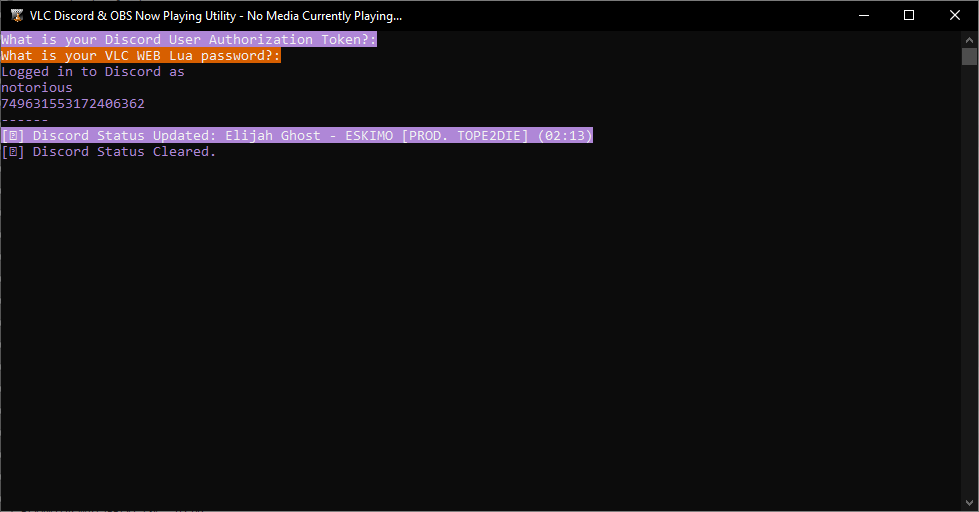

# VDONPU
 

 VLC Discord & OBS Now Playing Utility  
 Written in Python 3.9.1 
 
 * Discord Status Update
 * OBS Text GDI+ Output
 * Minimal Spam
 * Maintains Status on Pause
 * Cross-platform Friendly
 * Clears Status on Stop   
 
 
 
